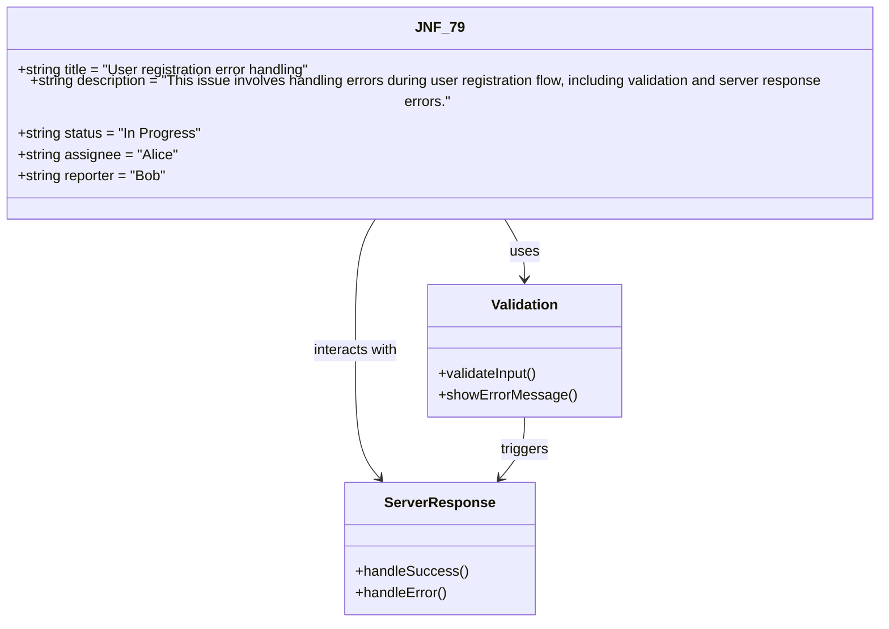

```mermaid
classDiagram
    class JNF_79 {
      +string title = "User registration error handling"
      +string description = "This issue involves handling errors during user registration flow, including validation and server response errors."
      +string status = "In Progress"
      +string assignee = "Alice"
      +string reporter = "Bob"
    }
    class Validation {
      +validateInput()
      +showErrorMessage()
    }
    class ServerResponse {
      +handleSuccess()
      +handleError()
    }

    JNF_79 --> Validation : uses
    JNF_79 --> ServerResponse : interacts with
    Validation --> ServerResponse : triggers
```