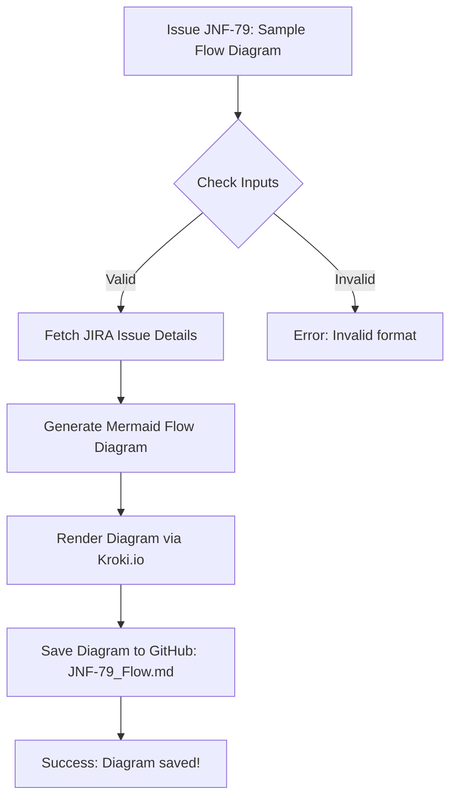

```mermaid
flowchart TD
    A[Issue JNF-79: Sample Flow Diagram] --> B{Check Inputs}
    B -->|Valid| C[Fetch JIRA Issue Details]
    C --> D[Generate Mermaid Flow Diagram]
    D --> E[Render Diagram via Kroki.io]
    E --> F[Save Diagram to GitHub: JNF-79_Flow.md]
    F --> G[Success: Diagram saved!]
    B -->|Invalid| H[Error: Invalid format]
```