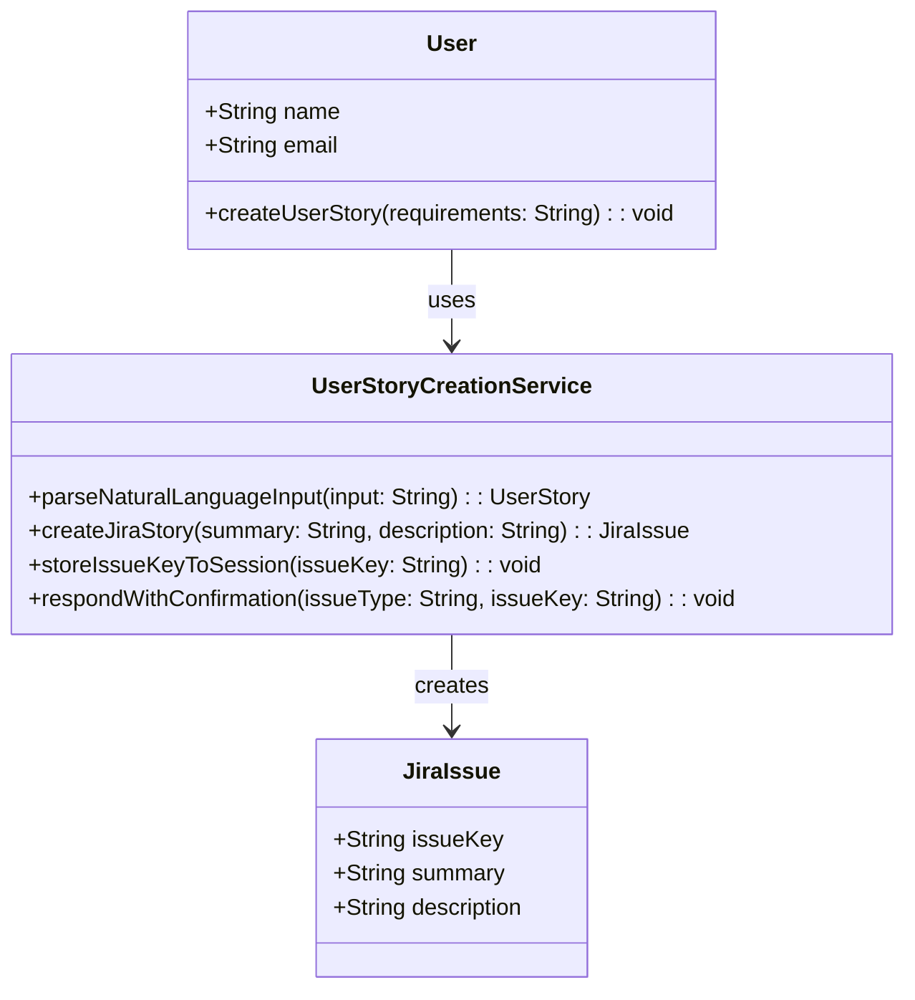

```mermaid
classDiagram
    class User {
        +String name
        +String email
        +createUserStory(requirements: String): void
    }

    class UserStoryCreationService {
        +parseNaturalLanguageInput(input: String): UserStory
        +createJiraStory(summary: String, description: String): JiraIssue
        +storeIssueKeyToSession(issueKey: String): void
        +respondWithConfirmation(issueType: String, issueKey: String): void
    }

    class JiraIssue {
        +String issueKey
        +String summary
        +String description
    }

    User --> UserStoryCreationService : uses
    UserStoryCreationService --> JiraIssue : creates
```
