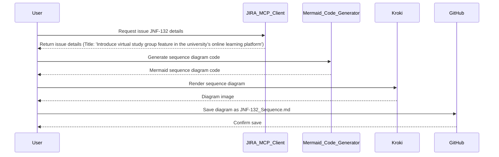

```mermaid
sequenceDiagram
    participant User
    participant JIRA_MCP_Client
    participant Mermaid_Code_Generator
    participant Kroki
    participant GitHub

    User->>JIRA_MCP_Client: Request issue JNF-132 details
    JIRA_MCP_Client-->>User: Return issue details (Title: 'Introduce virtual study group feature in the university’s online learning platform')
    User->>Mermaid_Code_Generator: Generate sequence diagram code
    Mermaid_Code_Generator-->>User: Mermaid sequence diagram code
    User->>Kroki: Render sequence diagram
    Kroki-->>User: Diagram image
    User->>GitHub: Save diagram as JNF-132_Sequence.md
    GitHub-->>User: Confirm save
```